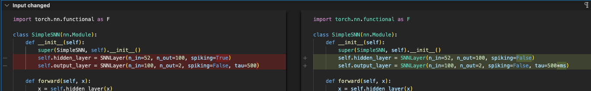
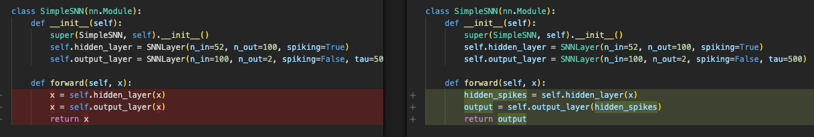

## Changes I pushed to your code

-   I added task 6, but that didn't really affect your code.
-   I added training time outputs for whenever we train models.
-   I added a skeleton for task 7, it should just be plug and play

## My points of concern: nothing pushed

-   .
-   I think the corrections I am proposing here are correct because task 7 is all about having one of the hidden layers as spiking, so we're not supposed to do that here, and I think it says so too. And when we set it to false, there are some very big issues, Loss basically goes towards infinity and it takes forever to run. Whereas it should be the case that when we make something spiking, it takes longer to run. So my guess is that there is something spiking. We should look into that.

### This one is a big deal and can really mess a lot of things up....

-   Maybe it's supposed to be 500 \* ms, thats what they might elude to in the text but I might be wrong. I think 500 \* ms messes up stuff even more.

-   
-   Small change, just makes the flow more legible imo.
